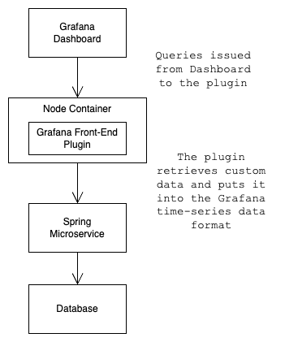
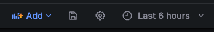

The purpose of a custom Grafana plugin is to provide project specific data to the Grafana Dashboard. Let's take a look at the architecture of a Grafana datasource plugin.



I created a front end Grafana plugin using the steps found here ...

https://grafana.com/developers/plugin-tools/tutorials/build-a-data-source-plugin

Note that in this scenario, all data comes from the plugin. No data is stored in Grafana.

When prompted for a plugin type, choose datasource with no backend part.

In **datasource.ts**, I created a method which calls a custom endpoint that returns a session id ...

```java
  // Calls custom web service for session id
  async getJwt() {
    const response = getBackendSrv().fetch<string>({
      url: `http://localhost:8080/adminJwt`
    });
    return await lastValueFrom(response);
  }

```

I also created a method which retrieves data from a custom endpoint ...

```java
  // Calls custom web service for data. Includes the session id.
  async getData(sessionId: string) {
    const response = getBackendSrv().fetch<SvrResp[]>({
      url: `http://localhost:8080/get`,
      credentials: 'include',
      headers: {
          Cookie: 'JSESSIONID=' + sessionId
      }
    });
    return await lastValueFrom(response);
  }

```

In the **testDatasource** method, I added custom code to make sure that we can successfully call one of the custom endpoints ...

```java
  async testDatasource() {
    // Implement a health check for your data source.

    // Custom code starts here

    const response = await getBackendSrv().fetch<any>({
      url: 'http://localhost:8080/get',
      headers: {
        mode: 'no-cors'
      }
    });
    await lastValueFrom(response);

    // End of custom code

    return {
      status: 'success',
      message: 'Success',
    };
  }

```

And finally, here's the **query** method which makes everything happen ...

```java
  async query(options: DataQueryRequest<MyQuery>): Promise<DataQueryResponse> {
    const { range } = options;
    const from = range!.from.valueOf();
    const to = range!.to.valueOf();

    // Custom code starts here ...

    console.log('options', options);
    const query = getTemplateSrv().replace('$brics', options.scopedVars);
    console.log('query', query);

    const res = await this.getJwt();
    const sessionId: string = res.data;
    console.log('sessionId - ', sessionId);

    const res2 = this.getData(sessionId);
    const data2 = (await res2).data;
    console.log('data = ', data2);

    // End of custom code

    // Return a constant for each query.
    const data = options.targets.map((target) => {
      return new MutableDataFrame({
        refId: target.refId,
        fields: [
          { name: 'Time', values: [from, to], type: FieldType.time },
          { name: 'Value', values: [3, data2[2].occurrences], type: FieldType.number }, // Passing a data value from the getData() call.
        ],
      });
    });

    return { data };
  }

```

Note that in the query method, we are retrieving a scoped variable.


The whole process is as follows ...

1. In the Grafana Admin Console, go to Connections
2. Search for and select your plugin
3. Press the "Create a Front End Datasource" button
4. Press "Save & Test"
5. Press "Build a Dashboard"
6. Press the gear icon 
7. Under Settings, click Variables
8. Click "Add Variable"
9. Choose variable type "custom"
10. Give the variable a name that you will reference from the plugin code.
11. Press the "Apply" button.
12. Save the dashboard
13. Press the "Add Visualization" button.
14. Select the plugin.
15. You should see a line chart and a drop down in the upper left of the dashboard with the variable values.

